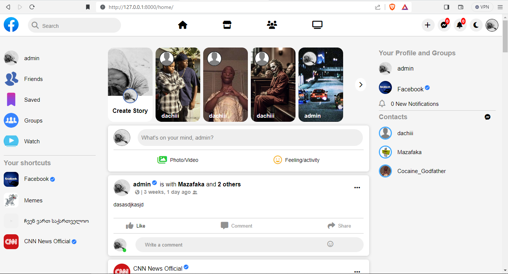

## Facebook Clone build in Python with MySQL database
**MAKE SURE TO INSTALL IT IN VIRTUAL ENVIRONMENT.**
The project is not complete and there will be bugs and unfinished pages.
It will be updated every day, make sure you have **MySQL** installed.

# SETUP GUIDE
     git clone https://github.com/Dachii11/Facebook-Clone-Using-Django.git
     cd Facebook-Clone-Using-Django
     pip install -r requirements.txt

## In your fb/settings.py add your email.
     ```
     EMAIL_HOST_USER = 'your_email_address'
     EMAIL_HOST_PASSWORD = 'your_password'
     ```

## Create MySQL database and add it to your fb/settings.py
     ```
     DATABASES = {
         'default': {
             'ENGINE': 'django.db.backends.mysql',
             'NAME': 'YOUR_DATABASE_NAME',
             'USER': 'MYSQL_USER',
             'PASSWORD': 'MySQL password',     // if password is not required remove this line of code.
             'HOST': 'localhost',
             'PORT': '3306',
              }
     }
     ```
## Run command to migrate Database
     python manage.py migrate
     
## command for Create superuser
     python manage.py createsuperuser

## Make sure you have created profile for superuser
     ```
     python manage.py shell
     >>> from django.contrib.auth.models import User
     >>> from accounts.models import Account
     >>> admin = User.objects.get(username='YOUR_SUPERUSER_USERNAME')
     >>> Account.objects.create(user=admin,id_user=admin.id)
     >>> quit()

**admin** page link: **loa1KDl0KL_03kffj_jKA_SF0k_l1K03_31KL_KDA/**


